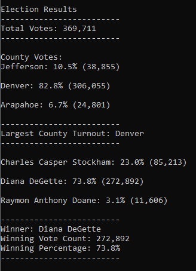

# Election Analysis

## Overview of Election Audit

A Colorado Board of Elections employee has asked for help with the analysis of election results for a recent congressional election. They would like an election summary report that includes the total votes, a breakdown by county, a breakdown by candidate, and the winner of the election based on the popular vote. I will be using Python to automate the process because they are hoping to use the same method for other elections in the future. 

## Election Audit Results

The analysis of the election show the following [results](analysis/election_results.txt):

- There were 369,711 votes cast in the election.
- The county turnout results were:
  - Jefferson County made up 10.5% of the total votes and had 38,855 number of votes.
  - Denver County made up 82.8% of the total votes and had 306,055 number of votes.
  - Arapahoe County made up 6.7% of the total votes and had 24,801 number of votes.
- The county with the largest number of votes was Denver.
- The candidate results were:
  - Charles Casper Stockham received 23.0% of the vote and 85,213 number of votes.
  - Diana DeGette received 73.8% of the vote and 272,892 number of votes.
  - Raymon Anthony Doane received 3.1% of the vote and 11,606 number of votes.
- The winner of the election was:
  - Diana DeGette, who received 73.8% of the vote and 272,892 number of votes.

## Election Audit Summary

This script can be used for any election after making some modifications. One example of how this script can be modified is changing the election results resource file. It's possible the results are in multiple files from the different voting methods or locations. The script could be changed to take this into account by appending the files if the formats are the same or looping through the files in the middle of the code while you're gathering the election information. Another example for modifying the script is to add another layer of variables and conditional statements so it can handle multiple ballot questions, which is typical in local elections.  
